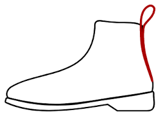
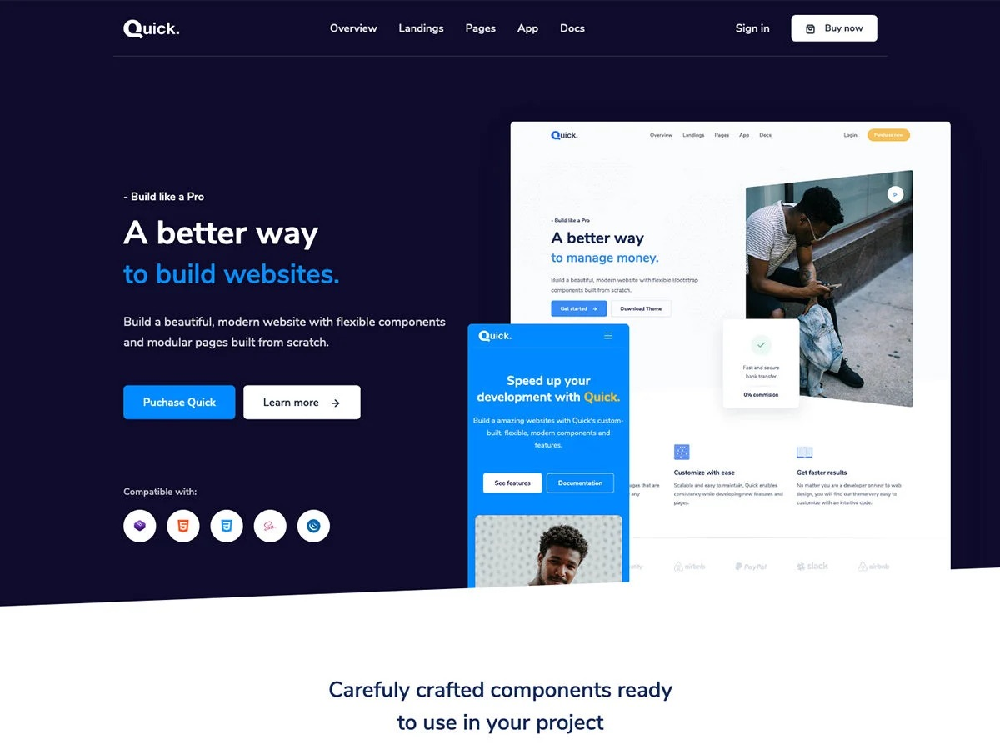

## The Thing on the Boot?
In regards to footwear, a bootstrap is a loop sewn at the side or back of a boot to help the user pull it on with ease. Without this simple loop, we would have to do that little “wiggle” we do to get into our boots/shoes. The concept is rather abstract, we took something already established, a boot, and made it easier to handle. Mundane as it may be, it improved the experience of boot users everywhere, saving us from making that silly face trying to put our shoes on.

## It’s also a Framework!
Similarly, the Bootstrap framework took something that was routine for web developers, HTML and CSS, and made it more practical. Bootstrap was created to build a responsive web page by making template designs available requiring less CSS styling and overall, taking less time to develop webpages. For me, all it took was simply inserting a few words and phrases into classes to create a more clean, responsive page.

## Advantages and Disadvantages
This is amazing! Less typing for me…but at what cost? In order to fully understand the competency and capabilities of Bootstrap 5, it first took up a lot of time and effort to go through the documentation to grasp what each component does for the webpage. However, although it took up all that time to get a hang of Bootstrap, it saved me a lot of time styling website elements such as the navigation bar and how I wanted certain objects to appear, just by inserting class elements into them; otherwise, I’d have to set up these stylistic edits manually via HTML and CSS which took much longer compared to using Bootstrap 5.

While Bootstrap is this amazing tool web developers can use to generate powerful websites efficiently, there are some limitations such as being able to modify certain elements. Bootstrap provides a template, so it’s harder to customize websites to what you may want them to look like. So if you want your website to look unique and not like the others, styling your website using raw CSS and HTML may be the way to go, as treacherous as it may be.

Looking at the disadvantages and advantages of Bootstrap we can see that it may be a tool that we either can use to efficiently build influential websites or something that we may want to avoid so that we can unleash the power of our creative minds.
