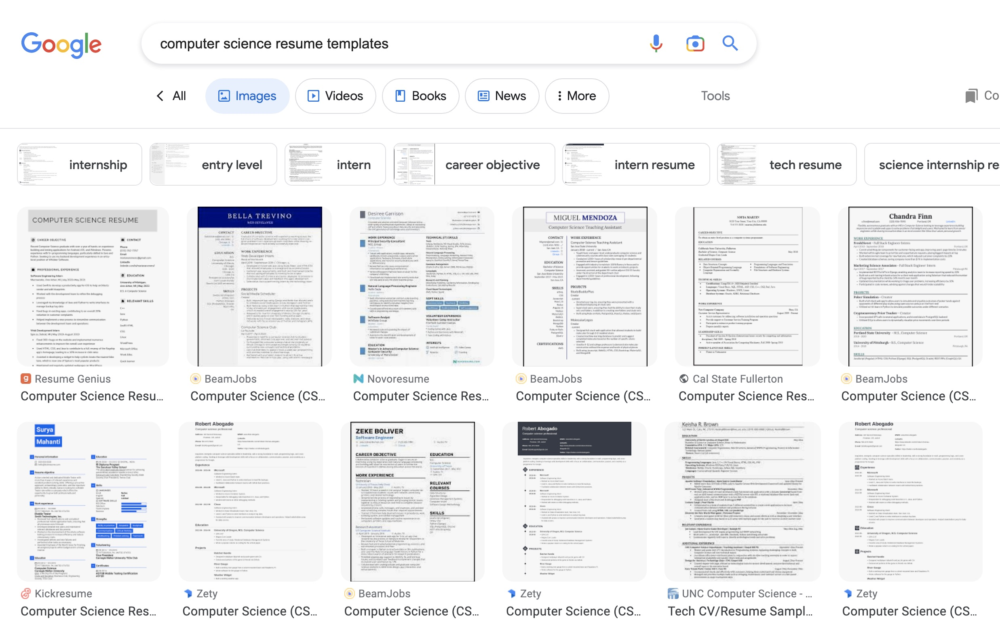

## The Art of Resume Templates

Have you ever tried to make a resume and you turn to the Google search, “resume templates” so that you can fit in with the crowd? Yes, it may be unoriginal and yes it may look boring, but one thing it’s not, is all-time consuming. Rather than having to format and place everything so that you will have the cleanest-looking resume, we turn to templates to make our lives just a little easier.

## Abstract Away!!!
Similarly, this abstraction by using a template is the general idea of design patterns. Instead of having each individual make their own resume format, we have this one (or multiple) template(s) that we can use to express different information in the same fashion. More formally, design patterns are general use solutions to common problems (i.e everyone needing a clean-looking resume)

## Making Our Lives a Little Easier
In my ICS 314 project, our group decided to utilize some design patterns to make things easier for us to code. For example, we had to mock up all of the ICS classes offered at UH Manoa, so instead of having to copy, paste, and format all of our data each time we needed to display all of the classes, we decided to have it as an external object and call it in whenever we need to access the information.

## Work Smarter Not Harder
Design patterns are like templates in our code. It makes our lives easier by abstracting reoccurring problems away. As Allen F. Morgenstern, an industrial engineer in the 1930s, once said, we should be “working smarter…not harder”.
