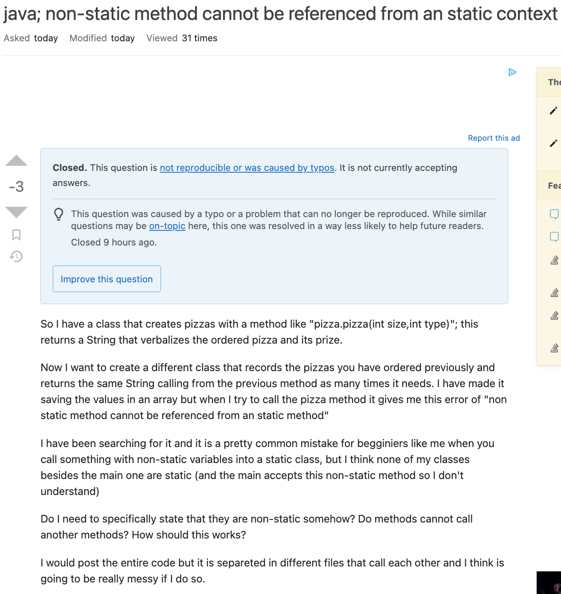

## The Nature of Questions

We’ve always been assured that “there are no stupid questions” which is in part true, in order to progress our knowledge, we constantly as questions whether it be to ourselves or other people. As we get into more technical field such as software engineering, it becomes more important to focus on the quality of questions we ask so that we get quality answers in return. To summarize some of the points Eric Raymond claims in the text [“How To Ask Questions The Smart Way”](http://www.catb.org/esr/faqs/smart-questions.html), a good question is said have some of the following qualities:
- ***Create meaningful headers*** so that it catches the readers attention and provides the reader with a good idea of what the question will be asking
- ***Describe the goal of the problem*** you’ve encountered or are trying to solve so people are aware of the point you’re trying to reach
- ***Being precise about your problem*** to give readers all the specifics of what is happening
- ***Describing the problem’s symptoms*** not the inference of what you think may be going wrong with it

## What a smart question looks like:     
This is an example of a smart question asked on [StackOverflow](https://stackoverflow.com/questions/8073673/how-can-i-add-new-array-elements-at-the-beginning-of-an-array-in-javascript). The header asks the question in a concise manner and proper background is given. We can see what the user is expecting and how the user wants to implement it. It asks a clear question and provides a general goal of what the user wants to accomplish. Because of the well-rounded nature of the question posted, in return, it received clear and concise answers in return that helped the user answer their question.

  
  
  
  
  

## What a not-so-smart question looks like:     
This is an example of a not-so-smart question asked on [StackOverflow](https://stackoverflow.com/questions/75251869/java-non-static-method-cannot-be-referenced-from-an-static-context). The header is worded in a way where readers may be left confused or lost on what the question may be about. Even though a reason for why the code isn’t included is presented, it would be helpful for readers to see what the method, the user is referencing, looks like; it would also be beneficial for the user to include what the error message looked like so other users may recognize what is going on. In addition, the user is grovelling by saying things like “it is a pretty common mistake for beginners like me…” which isn’t helpful for the proposition of their question. The ambiguity of this question is reflected in the responses to this post reflected when they state things like “It is unclear what exactly is static and non-static in your case” and they offer resources to help to user understand the general content better.

In general we can observe that questions which are asked in smart way receive more helpful responses compared to the questions that aren’t asked in a smart way.
  
  
  
  
  
