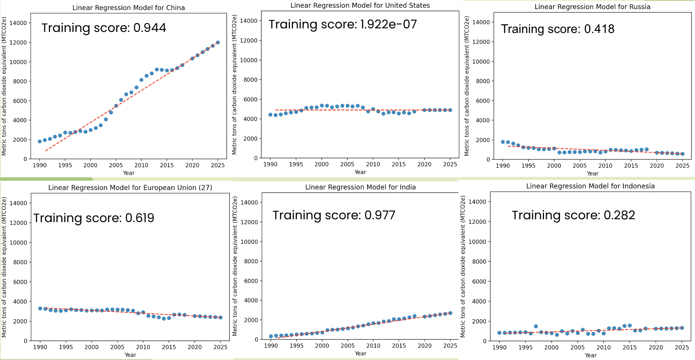

[AI4ALL](https://ai-4-all.org/) is a program that was created in hopes of inspring students to purse careers in AI. In the fall 2022 semester I participated in the AI4ALL UH Manoa program and learned about the applications and fundamental techniques of AI including the different types of machine learning methods. We also discussed the ethical implications related to the collection/manipulation of data and AI implementation. 

Throughout the program we were tasked to explore machine learning and its applications in the real world as well as investigate the positive and negative implications of AI. The motivation for our project was to predict trends in carbon dioxide over the years in different countries so we can focus on lowering emissions in the countries forcasted to increase their CO2 emissions. We did this by implementing a linear regression model on the data of some countries remarked in [this](https://www.kaggle.com/datasets/ankanhore545/carbon-dioxide-emissions-of-the-world) Kaggle dataset.

Here is the source code that was used to generate our models:

```python
import numpy as np
import pandas as pd
from sklearn.linear_model import LinearRegression
import matplotlib.pyplot as plt

#Carbon Dioxide Emissions of the World(1990-2018)
historicalEmissions = pd.read_csv("historical_emissions.csv")
cleanedData = historicalEmissions.drop(columns=['Unit', 'Country', 'Data source', 'Sector', 'Gas'])
cleanedData = cleanedData[np.isfinite(cleanedData).all(1)]
countries = historicalEmissions['Country']

x_train = []
x_plot = []

#retrieving x values (years) for training and plotting
for column in cleanedData.columns:
    x_train.append([column])
for i in range(2025, 1990, -1):
    x_plot.append(i)
x_train = np.array(x_train, dtype=int)

#running through the top 10 countries that contribute to CO2 emissions
for i in range(1, 11, 1):
    #retrieving y values from each row
    y_train = []
    for value in cleanedData.loc[i]:
        y_train.append(float(value))

    #training/fitting the linear regression model
    regModel = LinearRegression().fit(x_train, y_train)
    print("Training score for", countries[i], ":", regModel.score(x_train,y_train))

    #predicting on years 2019-2025 and adding it to the y values so we can plot it
    for j in range(2019, 2025, 1):
        y_train.insert(0, float(regModel.predict([[j]])))

    # outputting the scatter plot for each linear regression model
    plt.title("Linear Regression Model for " + countries[i])
    plt.xlabel("Year")
    plt.ylabel("Metric tons of carbon dioxide equivalent (MTCO2e)")
    plt.ylim(0, 15000)
    plt.scatter(x_plot, y_train)
    # plotting best fit line
    z = np.polyfit(x_plot, y_train, 1)
    p = np.poly1d(z)
    plt.plot(x_plot, p(x_plot), "r--")
    plt.show()
```
