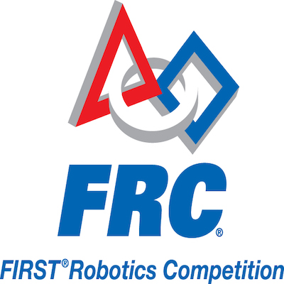

The [FIRST Robotics Competition](https://www.firstinspires.org/)(FRC) is a program designed to inspire and introduce high school students to the world of STEM. High School teams are given a challenge and are tasked to design, fabricate, build, wire, program, and drive a robot to compete against other teams. FRC promotes team work, problem solving skills, and chances to build both technical and soft skills.

In high school I was priviledged to work with an amazing team where we competed in the Sacramento regionals. On the team I served as a programmer/electrical, driver, and helped out on build team when needed. Throughout my high school career I gained experience in robot control such as manipulating PID values, sensors, and creating autonomous commands. FIRST played a major role in deciding that I wanted to go into computer science.