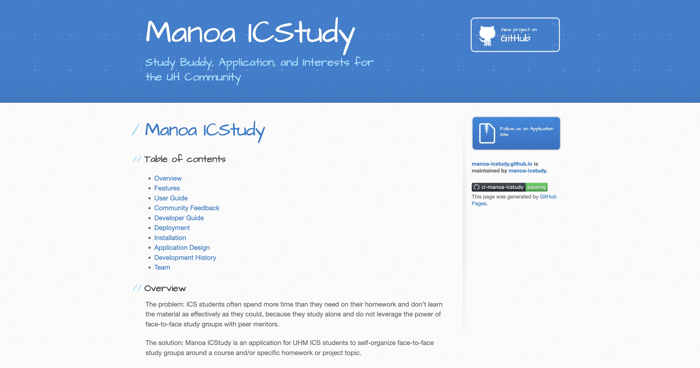

# Manoa ICStudy
[Manoa ICStudy](https://manoa-icstudy.site/home) is a web application designed to help students create study groups for their ICS classes here at UH Manoa. Users are able to crate and edit study sessions, join/leave study sessions, view the available study sessions on a calendar, and attain points that can be redeemed by joining/creating study sessions.

# Contributions
For this project, I worked in a group with 3 other members. We utilized issue driven project management, which was sort of a "to-do list" of all the tasks we had to accomplish for our web application to function and look decent. For this project, I picked up on a lot of issues such as the create/edit study sessions page, mocking up the UI for the study session list layout, and creating some of the Test Cafe tests for the website pages. I also took charge in updating our [githubio](https://manoa-icstudy.github.io/) page including the pictures and description of how our website ran.

# Conclusion
This experience taught me a lot about working on a software engineering type of project. I've also picked up a lot of skills in web development as well as learning to work in a team setting. I thought it was fun getting to learn new techniques and learning more about my group members while creating something we were all proud of.