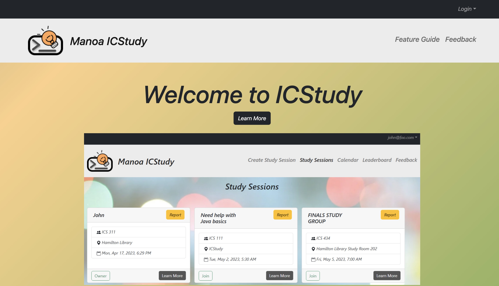

In Summer 2022, I was an undergraduate researcher under the supervision of an associate professor at UH Hilo. The motivation of the research was to make collecting data easier for research purposes. The domain we focused on was marine science where our goal was to reduce the cognitive load on scuba divers who have to focus on many variable such as monitoring their oxygen levels, tracking the fish, logging down their data, etc. This research decided to tackle this problem by focusing on improving multi-object tracking systems with the help of AI. I helped with evaluating the performance of this algorithm and running ablation tests on different parts of the code. [This](https://www.sciencedirect.com/science/article/pii/S0031320322005878) is the paper that was published regarding the reseach that was worked on.